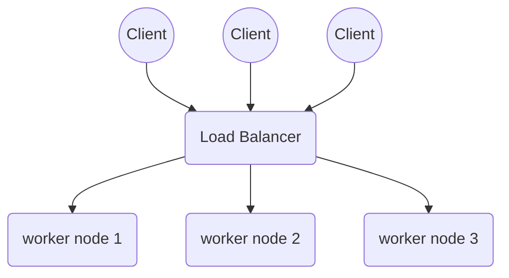
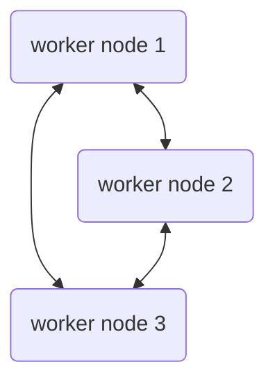

# Architecture 

## Overview

The distributed chat system is designed to handle high volumes in a scalable and resilient manner. The system leverages peer-to-peer architecture for chat nodes, where each node has equal capability and each node can handle user requests independently. 

To manage the incoming client traffic and to balance the load, a load balancer is used. This design ensures that nodes are not overwhelmed and that the service remains available even if one of the nodes fails. 

## System components

### Load Balancer

The load balancer is the primary entry point for client requests. It receives chat requests from clients and distributes them evenly across avalable chat nodes. A sophisticated strategy is used to distribute incoming requests evenly to nodes (a hybrid strategy with round-robin and least connections strategy). 

Additionally load balancer provides health monitoring and monitors the status of each node. 

### Peer-to-peer chat nodes

Chat nodes handle chat messages and manage user session. They also maintain "real-time" communication between clients. 

In peer-to-peer architecture each node is idential in function and in status. Each node can independently process incoming requests allowing horizontal scalability of the system. 

Nodes also synchronize data (i.e. user data, message history) to ensure consistent user experience and a "concurrent real-time" experience from the end users perspective. 

In the most simple use case, the service operates with three worker nodes: 

### Clients

End users interact with a text based user interface by sending messages to the service. 

## Technical description

WRITE THIS OUT IN A CLEANER FORM

- Loadbalancer
  - When starting, node gets LBs name
  - perhaps a certificate etc for security? 
- each node should have atleast two neighbours
- when neighbours are known, could be connection check (handshake, etc...)
  - this could be used as polled health check as well
-   when all three nodes are setup (the simplest case), the LB checks the health of each node and passess client requests to nodes. 
  - if node not available, client must wait OK response from LB
  - we could use Round-robin etc. for distributing requests to nodes
- nodes can listen to a socket for messages
  - perhaps a confirmation to client that new message has been received
  - perhaps client should poll for new messages  
 - worker nodes: 
   - maintain state
   - have neighbours (peers)

Questions
- How do nodes have a shared state of discussion history? 

