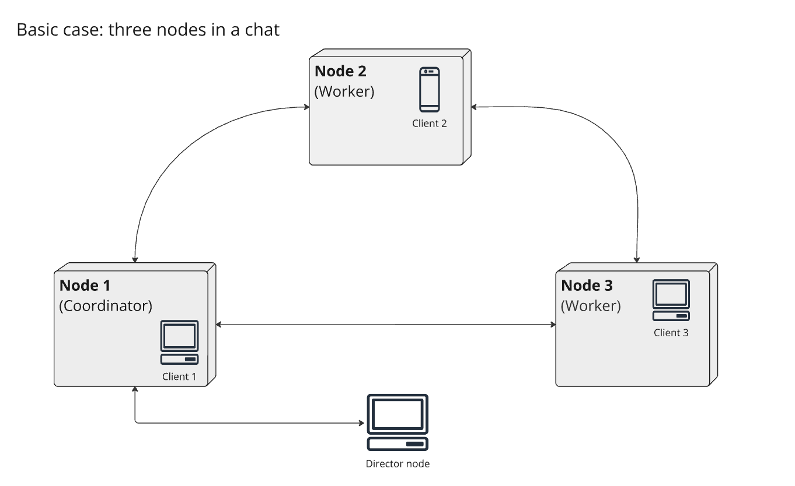
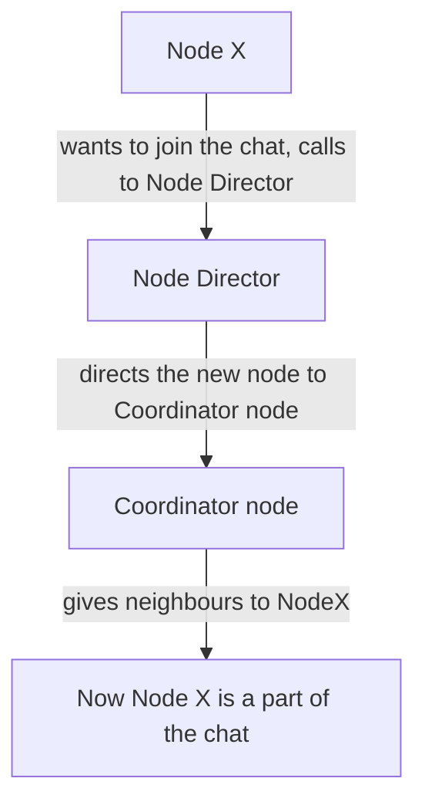

# Group Project Work Plan

**Course:** CSM13001 Distributed Systems, University of Helsinki  
**Members:** Juha Väisänen, Pekka Prökkinen, Ville Hänninen, Heidi Holappa  
**Group number:** 9  

## Format Clarification
Please note that this document does not include a cover page as per the guidance from our lecturer. This decision allows us to render the document directly from markdown to PDF for ease of use and consistency.

## Introduction

The purpose of this project is to research distributed chat systems and to implement a working prototype. As a novel approach, this system does not contain persistent storage. Instead, chat discussions are transient, like phone calls, and remain active only until all nodes leave the communication. At that point, the discussion is gone and cannot be retrieved.

The justification for such an implementation is that in today's world, we all live with an ever-growing digital footprint. At the same time, many of us have a need for private communication. Most social media services maintain communication history, making it difficult to clear previous discussions. This project introduces an approach in which each discussion is transient by default, promoting a new type of real-time, text-based communication.

## Techical overview

The system under design provides a chat application for end users. When users launch the application to initiate a chat discussion, the client application becomes one of the **chat-nodes** (later nodes) in the distributed chat system. The system includes a **node director** responsible for connecting nodes to each other. In this proof-of-concept version all nodes participate in the same discussion.

Terminology:
- **node:** chat-node sends and receives messages from other chat-nodes. Chat-node can also serve as a coordinator for other chat-nodes (detailed later in the document)
- **node director:** node director connects new chat-nodes into the group discussion. Node director does not participate in chat discussion, but communicates with the coordinator node (detailed later in the document)



### Coordinator node

Mechanisms will be in place to handle situations where nodes join or leave the discussion and to resolve any discrepancies in discussion histories among nodes. The team has chosen to implement a coordinator role and an election process initially based on the bully algorithm. The elected coordinator has several duties. It:

- Maintains an up-to-date record of nodes in the discussion.
- Assists new nodes in joining the discussion by providing them with a replica of the current state of the group discussion and the addresses of all nodes in the discussion.
- Keeps in contact with the node director to ensure the node director is aware of the current coordinator node and performs health checks on the node director.  

### Node director
The Node Director has two primary functions: it directs clients to the current coordinator's server and keeps information about the coordinator. When a client connects to the director, they are redirected to the coordinator’s server. To ensure continuity, the coordinator notifies the director of its presence every few seconds, allowing the director to stay up-to-date on the current coordinator. To support these functions, the director provides three endpoints:

`GET /` Redirects the client to the current coordinator's server.  
`POST /register_coordinator` The node director receives the coordinator's ID, internal address and public address.  
`POST /register_node` The node director receives a new node's ID, internal address and public address, then forwards this information to the coordinator.  

<div class="page"/>

### Joining group discussion

When a new node wants to join the chat, it connects first to the Node Director with a known name. The Node Director directs it to a coordinator node, which gives two neighbour nodes to exchange messages with. Now the new node is ready for multicasting new messages to its neighbours and to receive messages from them.



<div class="page"/>

### Sending and receiving messages

The nodes will send chat messages to all other nodes in the group discussion. The team will investigate a mechanism for transferring chat messages to each other efficiently. The idea is to simulate multicast functionality that works also when the nodes are in different networks. As a starting point, the team investigates using websockets or HTTP/2-protocol for inter-node communication. As communication between nodes is direct node-to-node discussion, no middleware is required in this proof-of-concept phase.  

The team has outlined the necessary messages for the system currently under design. While the communication technology and protocol are still being evaluated, the final format of these messages has not yet been determined. For clarity and readability, the proposed message content is presented in JSON format. Regardless of the chosen technology, these examples will illustrate the intended structure and content.

#### Chat messages  

Any node (i.e. chat-node) can send chat-messages to other nodes: POST `/message/`
```json
{ 
    "id": "uuid",
    "node-id": "uuid",
    "timestamp": "timestamp",
    "message": "string"
    "vector-clock:" ["int"]
}
```

#### Election process  

Messages related to the election process with Bully-algorithm:


Any node can initiate election process by sending a request to nodes with higher priority: POST `/election`
```json
{
    "node-id": "uuid"
}
```

Higher priority nodes respond with an OK: POST `/submit-vote`
```json
{
    "ok": "uuid"
}
```
<div class="page"/>

Once one of the nodes has bullied other into submission, they notify other nodes that they are the new coordinator: POST `/update-coordinator`
```json
{
    "coodinator": "uuid"
}
```


#### Communication with coordinator node  

The coordinator node can send a message requesting other nodes to update the record of actives nodes in group discussion after nodes join or leave the discussion: POST `/active-nodes`
```json
{
    "node": ["uuid"]
}
```

Any node can get the discussion history from coordinator node: GET `/discussion`

The coordinator then responds with the discussion history (a list of message objects): POST `/discussion`

```json
{
    "messages": [
        { 
            "id": "uuid",
            "node-id": "uuid",
            "timestamp": "timestamp",
            "message": "string"
            "vector-clock:" ["int"]
        }
    ] 
}
```

### Consistency in discussion 

To ensure message consistency in our distributed chat system, our team implements vector clocks for reliable sequencing across nodes without the need for centralized synchronization. Each node is equipped with a vector clock that meticulously tracks the events it processes. Whenever a node sends a message, it first increments its clock, embedding this updated information within the message itself. Upon receipt, a node merges its vector clock with that of the sender, harmonizing both histories. This methodological merging not only maintains historical accuracy but also aids in identifying causal relationships and resolving potential conflicts, thereby supporting our system's scalable and efficient message ordering.

<div class="page"/>

### Language selection

The chat nodes and the node director will be implemented using Node.js. Node.js has a strong reputation in handling asynchronous calls, which the team considers to be a critical functionality for the system under design. 

### No persistent storage

As the motivation is to built a system for group discussions without any persistent memory, no database is necessary for this proof-of-concept. Once all client applications shut down, the discussion is lost forever.

### Container technology

All nodes will reside within containers, which may or may not be located on the same physical machine. This containerized approach ensures flexibility, scalability, and ease of deployment across different environments.


## Schedule

During the first two weeks of the project, the team has concentrated on research and planning. They have designed a preliminary architecture for the implementation and selected the technologies to be used. With these foundational steps completed, the project is now poised to enter the development phase. 

However, some critical details still need to be finalized. Specifically, the technical aspects of inter-node communication and synchronization are yet to be determined. These topics will be addressed in the lectures during weeks 3 and 4, after which the necessary design decisions will be made.

In the meantime, the team can proceed by developing the chat nodes and the node director. This phased approach allows for continuous progress while awaiting further clarification on the remaining technical issues.

## Group practices

The team maintains active communication through a group discussion on Telegram. Each weekend, they hold an online call to plan the upcoming week and discuss any current issues. Work items are coordinated using a Kanban-style project board on GitHub, where tasks are tracked as issues. This approach helps the team better estimate workloads, coordinate active tasks, and plan the project's timeline effectively.

## Use of LLMs 

University of Helsinki Large Language Model Curre, Microsoft Co-pilot and Chat-GPT have been used to help improve the grammar of the documentation and to polish the text. Separate LLMs have been prompted to provide feedback on text and to suggest improvements. The response has then been evaualuated and with consideration applied to improve the text. 